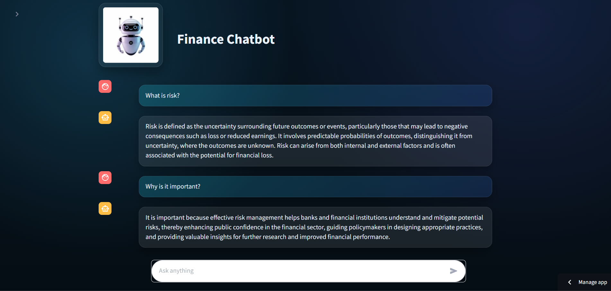
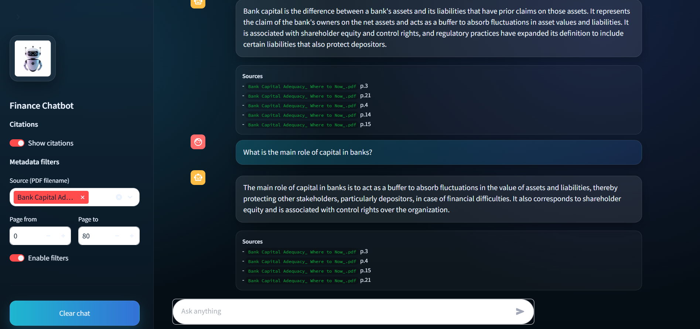

#  Finance  Chatbot

A production-ready **Retrieval-Augmented Generation (RAG) chatbot** built with **Streamlit**, **LangChain**, and **ChromaDB**, designed to answer finance-related questions using **domain-specific PDF documents** with optional **source citations** and **metadata-based filtering**.

🔗 **Live Demo:**  
https://finance-rag-chatbot.streamlit.app/

---

##  Overview

Finance RAG Chatbot enables users to ask natural-language questions about financial concepts (e.g. risk, capital adequacy, banking regulations) and receive **context-aware, document-grounded answers**.

Unlike generic chatbots, this system retrieves the most relevant passages from uploaded PDFs and generates answers **strictly grounded in the source documents**, reducing hallucinations and improving factual reliability.

---

##  Key Features

###  Retrieval-Augmented Generation (RAG)
- Semantic search over PDF documents
- Vector embeddings stored in **ChromaDB**
- Context-aware answer generation using retrieved passages

###  Conversational Memory
- Short-term memory using recent chat history
- Enables follow-up questions and coherent multi-turn conversations

###  Source Citations
- Answers can include exact **PDF filename + page number**
- Transparent and auditable responses
- Toggle on/off from the UI

###  Metadata Filtering 
- Filter retrieval by:
  - Source document (PDF filename)
  - Page range
- Uses ChromaDB `$and` filtering logic
- Fully optional, controlled from the sidebar


---

##  Demo Screenshots

### Chat (Demo Mode – no filters, no citations)


### Chat with Citations & Metadata Filters


---

##  Architecture
User Question -> Embedding Model -> ChromaDB Vector Store -> Relevant Chunks  -> Prompt + Chat History -> LLM Answer -> Answer +  Citations

---

##  Project Structure


```text
RAG-Chatbot/
├── app/
│   ├── streamlit_app.py   # Streamlit UI
│   ├── style.css          # Custom UI styles
│   └── assets/            # Images & branding
│
├── rag/
│   ├── ingest.py          # PDF ingestion & chunking
│   ├── retriever.py       # ChromaDB retrieval logic
│   ├── qa.py              # RAG pipeline (retrieve + generate)
│   ├── prompt.py          # Prompt templates
│   └── config.py          # Model & path configuration
│
├── data/
│   ├── raw/               # Original PDF documents
│   └── chroma/            # Persisted vector database
│
├── docs/
│   ├── demo_chat.png
│   └── demo_filters.png
│
├── requirements.txt
└── README.md

---

##  Setup Instructions

### Clone the repository
```bash
git clone https://github.com/your-username/finance-rag-chatbot.git
cd finance-rag-chatbot
```

### Create & activate virtual environment
python -m venv .venv

### Install dependencies
pip install -r requirements.txt

## Ingest Documents
### Place PDF files inside:
    data/raw/
### Run ingestion:
python rag/ingest.py

This process:

Loads PDFs

Splits text into chunks

Generates embeddings

Stores vectors + metadata in ChromaDB

## Run the Application
streamlit run app/streamlit_app.py

### The app will be available at:

http://localhost:8501

### Usage Notes

## Demo mode:
Disable Show citations and Enable filters for a clean demo experience.

## Research mode:
Enable citations and metadata filters to inspect sources.

## Best results:
Ask finance-related questions aligned with the uploaded documents.

###Technologies Used

Python
Streamlit
LangChain
ChromaDB
OpenAI 
PDF parsing & tokenization

## Use Cases

Financial education
Banking & risk management research
Internal document QA systems
RAG architecture demonstrations
AI/ML portfolio projects


## License
This project was developed as part of professional work at *Genpact* and is shared for demonstration purposes only; all rights are reserved.

##Author

Built as a production-style RAG chatbot showcasing modern AI application design with document-grounded generation.